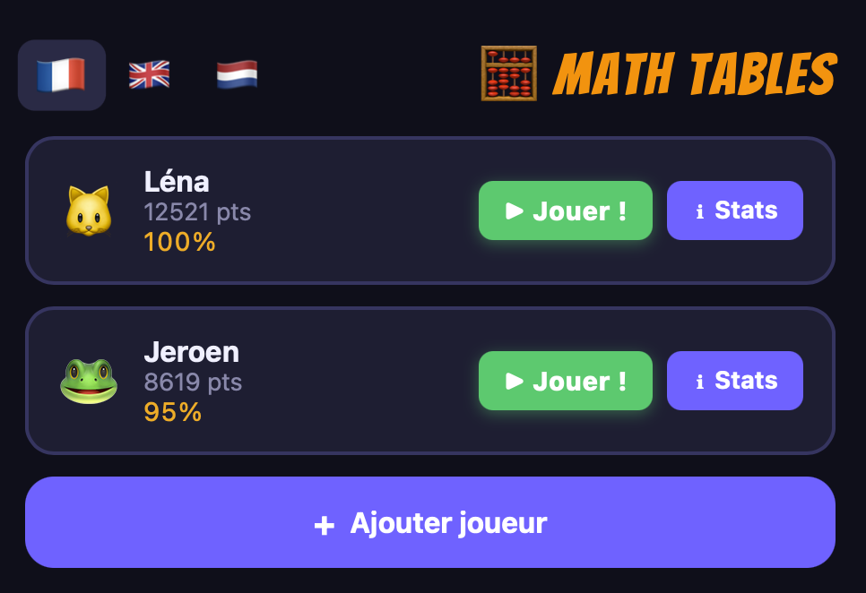
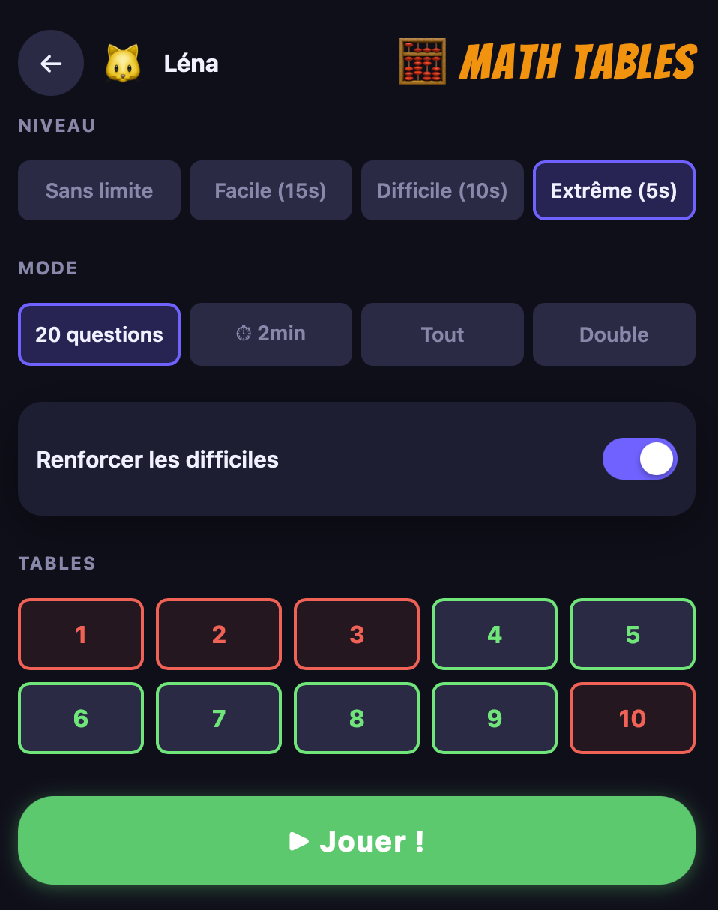
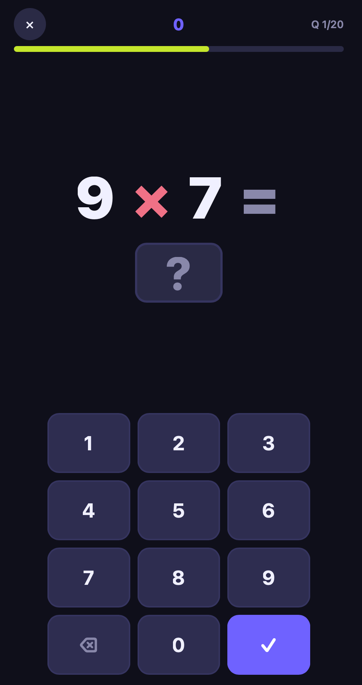
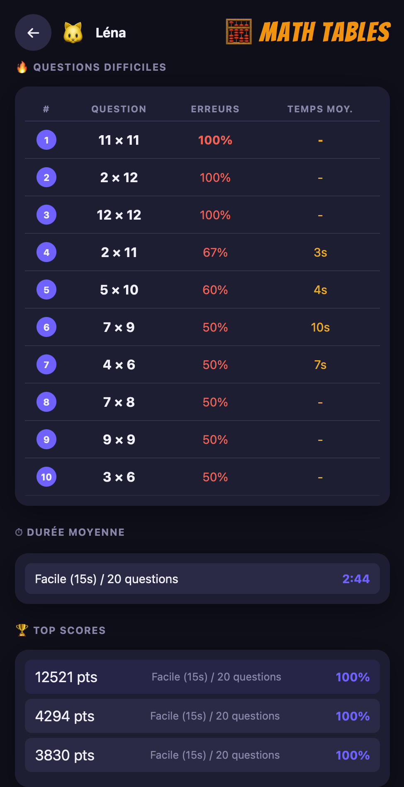

# Math Tables

A multiplication tables learning game for children. Supports multiple player profiles, adaptive difficulty, and detailed statistics.

## Screenshots

  
  
  
  

## Features

- Multiple player profiles with emoji avatars
- Four difficulty levels (no limit / 15s / 10s / 5s) with score bonuses for harder levels
- Four game modes: 20 questions, 2-minute sprint, all tables, double (reversed)
- Score boosted by speed, answer streaks, and hard question multipliers (×2 or ×4 for factors 6–9)
- Boost mode: surfaces your personal hardest questions more often
- Per-player statistics: top 10 scores, hardest questions, average durations
- French, English, and Dutch UI
- Works fully offline — no server, no dependencies

## Running

Open `index.html` directly in any modern browser. No build step required.

## iOS App

The Xcode project wraps the game in a native iOS app via WKWebView.
`MathTables/index.html` is the build source. The root `index.html` is a symlink to it for browser development.

## Specs

- [Functional specification](SPEC-FUNCTIONAL.md)
- [Technical specification](SPEC-TECHNICAL.md)
